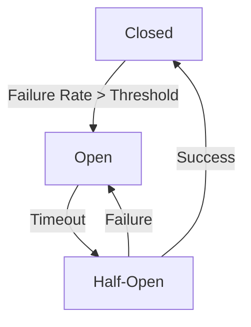
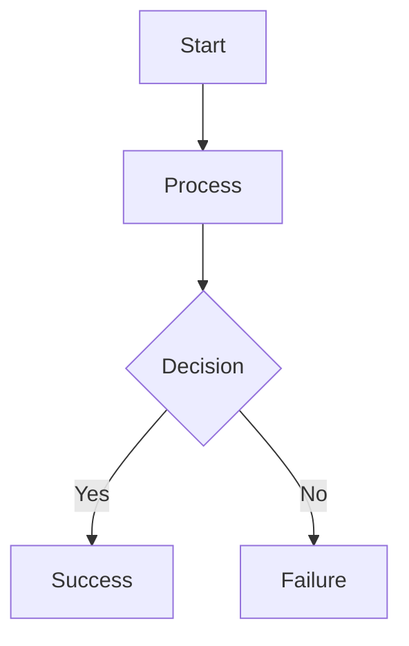
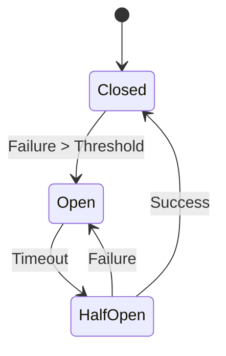
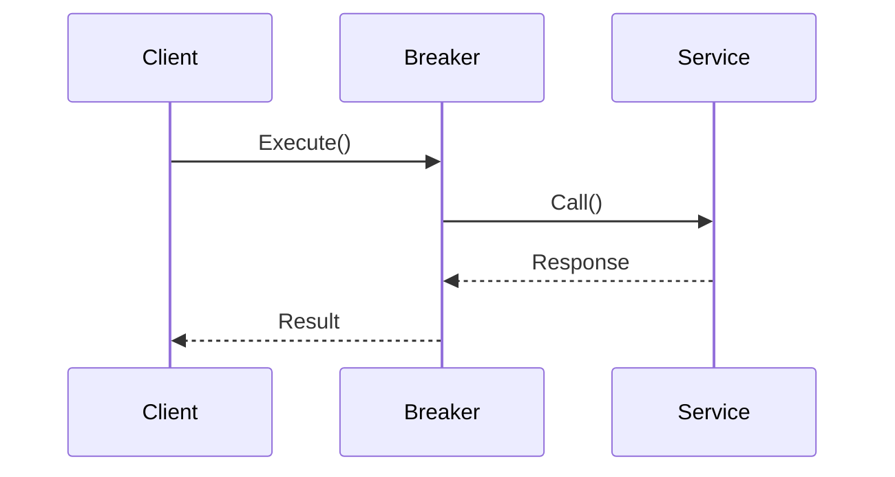

# AutoBreaker Documentation Site

This directory contains the source for the AutoBreaker documentation site, built with [Hugo](https://gohugo.io/) and the [hugo-book](https://github.com/alex-shpak/hugo-book) theme.

The site is deployed to GitHub Pages at: https://vnykmshr.github.io/autobreaker/

## Quick Start

### Prerequisites

1. **Install Hugo** (extended version recommended):
   ```bash
   # macOS with Homebrew
   brew install hugo
   
   # Linux/Windows: Download from https://github.com/gohugoio/hugo/releases
   ```

2. **Verify installation**:
   ```bash
   hugo version
   # Should show "extended" version
   ```

### Local Development

1. **Start the development server**:
   ```bash
   cd docs
   hugo server -D
   ```

2. **Open in browser**:
   - Main site: http://localhost:1313/autobreaker/
   - Draft content: http://localhost:1313/autobreaker/?showDrafts=true

3. **Auto-reload**:
   - Hugo automatically reloads when you save changes
   - Changes appear instantly in the browser

## Project Structure

```
docs/
├── assets/           # Custom CSS, JS, images
│   └── css/
│       └── custom.css
├── content/          # All documentation pages
│   ├── _index.md     # Landing page
│   ├── getting-started/
│   ├── guides/
│   ├── contributing/
│   ├── security/
│   ├── changelog/
│   └── migration/
├── static/           # Static assets (logo, favicon)
│   ├── logo.svg
│   └── favicon.svg
├── layouts/          # Custom layouts (if needed)
├── hugo.toml         # Hugo configuration
└── README.md         # This file
```

## Adding New Content

### 1. Create a New Page

**Basic page**:
```bash
hugo new content/guides/new-topic.md
```

**Page with specific section**:
```bash
hugo new content/guides/advanced/new-topic.md
```

### 2. Page Front Matter

Every page needs front matter (YAML at top):

```yaml
---
title: "Page Title"
description: "Brief description for SEO"
date: 2026-01-24
weight: 10  # Navigation order (lower = earlier)
draft: false  # Set to true for work-in-progress
---
```

### 3. Content Guidelines

**Use Markdown with Hugo shortcodes**:

```markdown
# Main Heading

## Subheading

Regular text with **bold** and *italic*.

### Code Examples

```go
// Go code example
breaker := autobreaker.New(settings)
```

### Mermaid Diagrams



### Links

- [Internal link](/guides/state-machine/)
- [External link](https://pkg.go.dev/github.com/vnykmshr/autobreaker)
- [API Reference](https://pkg.go.dev/github.com/vnykmshr/autobreaker){target="_blank"}

### Images


### Notes and Warnings


**Information**: Use for helpful tips and explanations.



**Warning**: Use for important cautions.



**Danger**: Use for critical warnings.

```

## Mermaid Diagrams

The site supports [Mermaid](https://mermaid.js.org/) diagrams for visualizing architecture and workflows.

### Basic Flowchart



### State Diagram



### Sequence Diagram



### Best Practices

1. **Keep diagrams simple** - Focus on one concept per diagram
2. **Use meaningful labels** - Clear, descriptive node names
3. **Test locally** - Verify diagrams render correctly
4. **Update with code** - Keep diagrams synchronized with implementation

## Code Examples

### Verification Process

All code examples should:

1. **Compile correctly** - Test with `go build`
2. **Use current API** - Match the latest library version
3. **Include imports** - Show required packages
4. **Be self-contained** - Can be copied and run

### Example Template

````markdown
```go
package main

import (
    "context"
    "fmt"
    "time"
    
    "github.com/vnykmshr/autobreaker"
)

func main() {
    settings := autobreaker.Settings{
        Name: "example",
        Timeout: 5 * time.Second,
    }
    
    breaker := autobreaker.New(settings)
    
    result, err := breaker.Execute(func() (interface{}, error) {
        // Your operation here
        return "success", nil
    })
    
    fmt.Printf("Result: %v, Error: %v\n", result, err)
}
```
````

## Navigation Configuration

Navigation is configured in `hugo.toml`:

```toml
[[menu.main]]
  name = 'Getting Started'
  pageRef = '/getting-started'
  weight = 1

[[menu.main]]
  name = 'Guides'
  pageRef = '/guides'
  weight = 2

[[menu.main]]
  name = 'API Reference'
  url = 'https://pkg.go.dev/github.com/vnykmshr/autobreaker'
  weight = 4
```

### Adding to Navigation

1. **Automatic**: Pages in `content/` are automatically added to sidebar
2. **Manual**: Add entries to `[[menu.main]]` in `hugo.toml`
3. **Weight**: Lower numbers appear earlier (1 = first)

## Styling and Branding

### Custom CSS

The site uses Go blue (#00ADD8) as the primary accent color. Custom styles are in `assets/css/custom.css`:

```css
:root {
  --primary: #00ADD8;        /* Go blue */
  --primary-dark: #0099c3;
}

[data-theme="dark"] {
  --primary: #00ADD8;
  --primary-dark: #33c5e8;
}

/* Go syntax highlighting */
.language-go .hljs-keyword {
  color: #00ADD8;
}
```

### Logo and Favicon

- **Logo**: `static/logo.svg` - Circuit breaker switch with Go blue gradient
- **Favicon**: `static/favicon.svg` - Simplified version

## Deployment

### CI/CD Pipeline

The site is automatically deployed via GitHub Actions:

1. **On push to main**: Builds and deploys to GitHub Pages
2. **On pull request**: Builds and validates (no deployment)
3. **Manual trigger**: Can be triggered from GitHub UI

### Workflow Files

- `.github/workflows/docs.yml` - Main deployment workflow
- `.github/workflows/docs-pr.yml` - PR validation workflow

### Manual Deployment

```bash
# Build site
cd docs
hugo --minify --cleanDestinationDir

# Output is in docs/public/
# Can be deployed to any static hosting
```

### Rollback Procedure

If deployment issues occur:

1. **Disable GitHub Pages** in repository settings
2. **Revert the commit** that caused issues
3. **Re-enable GitHub Pages** after fix

## Quality Assurance

### Pre-commit Checks

Before committing documentation changes:

1. **Build locally**:
   ```bash
   cd docs
   hugo --minify
   ```

2. **Check for errors**:
   ```bash
   # Look for build errors
   hugo 2>&1 | grep -i error
   ```

3. **Verify links** (optional):
   ```bash
   # Install link checker
   npm install -g markdown-link-check
   
   # Check all markdown files
   find docs/content -name "*.md" -exec markdown-link-check {} \;
   ```

4. **Test code examples**:
   ```bash
   # Extract and test Go code examples
   # (Manual verification recommended)
   ```

### Automated Checks

GitHub Actions automatically runs:

- **Hugo build** - Verifies site compiles
- **Link checking** - Validates internal/external links
- **File validation** - Checks for proper formatting

## Troubleshooting

### Common Issues

**1. Hugo not found**:
```bash
# Install Hugo
brew install hugo  # macOS
# or download from https://github.com/gohugoio/hugo/releases
```

**2. "Extended version required"**:
- Download extended version from Hugo releases
- Verify with `hugo version | grep extended`

**3. Changes not appearing**:
- Clear browser cache
- Restart Hugo server: `hugo server -D --disableFastRender`
- Check if page is draft: `draft: true` in front matter

**4. Mermaid diagrams not rendering**:
- Verify `BookMermaid = true` in `hugo.toml`
- Check diagram syntax for errors
- Clear browser cache

**5. Search not working**:
- Search index builds on production deploy
- Local development uses limited search
- Full search works on GitHub Pages

### Getting Help

1. **Hugo Documentation**: https://gohugo.io/documentation/
2. **hugo-book Theme**: https://github.com/alex-shpak/hugo-book
3. **Mermaid.js**: https://mermaid.js.org/
4. **GitHub Issues**: Report documentation issues in the main repository

## Performance Optimization

### Build Optimization

- **Minification**: Enabled in production builds
- **Compression**: GitHub Pages handles gzip/brotli
- **Image optimization**: Use SVG where possible

### Page Load Optimization

- **Lazy loading**: Images load on demand
- **Code splitting**: JavaScript loaded as needed
- **Caching**: Aggressive cache headers

### Monitoring

- **GitHub Pages analytics**: Basic traffic data
- **Performance**: Lighthouse scores tracked
- **Uptime**: GitHub status monitoring

## Contributing

### Workflow

1. **Fork the repository**
2. **Create a feature branch**
3. **Make documentation changes**
4. **Test locally** with `hugo server -D`
5. **Submit pull request**

### Review Process

All documentation changes go through:

1. **Technical accuracy** - Code examples must compile
2. **Editorial quality** - Clear, concise, professional
3. **Visual consistency** - Follows branding guidelines
4. **Navigation logic** - Properly placed in site structure

### Style Guide

- **Tone**: Professional, technical, helpful
- **Voice**: Active voice, second person ("you")
- **Formatting**: Consistent Markdown with Hugo shortcodes
- **Examples**: Real, compilable code
- **Diagrams**: Mermaid for complex concepts

## License

Documentation is licensed under [CC BY-SA 4.0](https://creativecommons.org/licenses/by-sa/4.0/).

Code examples are licensed under the same MIT license as the AutoBreaker library.
