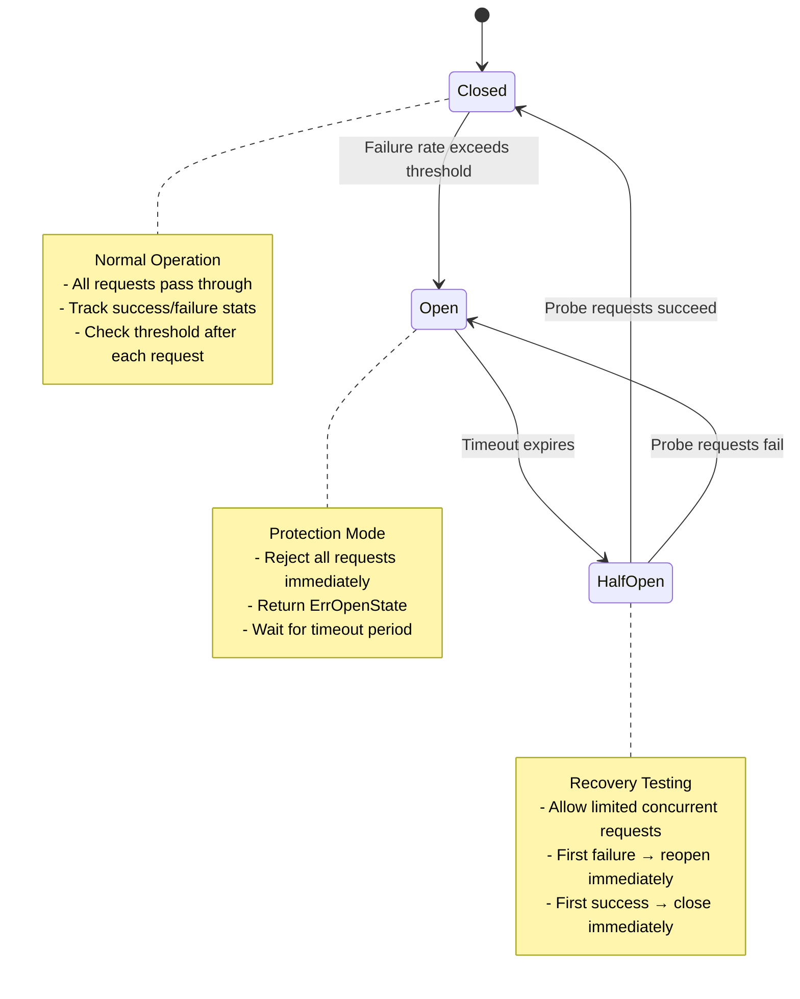
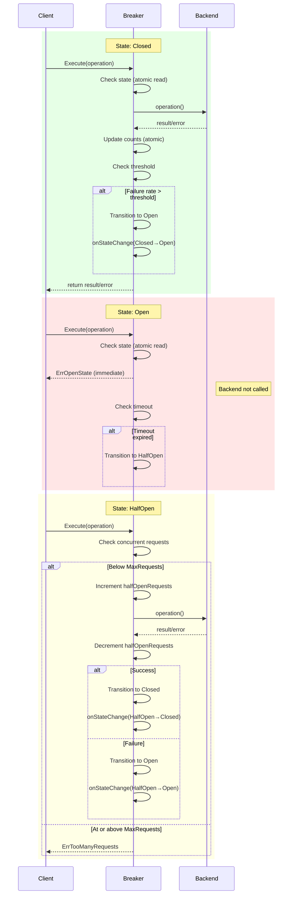

# Adaptive Circuit Breakers: Why Static Thresholds Fail at Scale

## Introduction

Circuit breakers are a fundamental pattern for building resilient distributed systems. They protect services from cascading failures by detecting unhealthy backends and failing fast instead of waiting for timeouts. The pattern is well-understood, widely adopted, and seemingly straightforward.

Yet most implementations share a critical flaw: they use static failure thresholds that break down under real-world traffic conditions.

This article examines why traditional circuit breakers struggle with variable traffic, presents a solution using adaptive percentage-based thresholds, and explores the architecture of a production-grade implementation optimized for both performance and observability.

## The Problem with Static Thresholds

Traditional circuit breakers trip when a fixed number of failures occurs within a time window. For example: "open the circuit after 10 failures in 60 seconds."

This approach appears sensible until you consider how it behaves across different traffic volumes:

**High Traffic Scenario (1000 requests/minute):**
- 10 failures = 1% error rate
- Circuit trips at 1% errors (too sensitive)
- Results in false positives during minor hiccups
- Degrades availability unnecessarily

**Low Traffic Scenario (10 requests/minute):**
- 10 failures = 100% error rate
- Waits for complete failure before protection
- Results in slow detection and recovery
- Allows extended periods of failed requests

**The Core Issue:** The same absolute threshold (10 failures) represents vastly different failure rates depending on traffic volume. No single static value works well across both scenarios.

This becomes particularly problematic in practice:

- Development environments (low traffic) need different thresholds than production (high traffic)
- Traffic patterns vary throughout the day, week, and year
- Services experience traffic spikes during incidents, load tests, or viral events
- Microservices architectures create diverse traffic patterns across different service boundaries

Manual threshold tuning for each environment and traffic pattern is fragile, error-prone, and doesn't adapt to changing conditions.

## The Solution: Percentage-Based Adaptive Thresholds

Instead of counting absolute failures, adaptive circuit breakers calculate the **failure rate as a percentage of recent requests**:

```
Failure Rate = (Failed Requests / Total Requests) × 100%

Trip Condition: Failure Rate > Threshold (e.g., 5%)
```

This single change makes the circuit breaker traffic-aware:

| Traffic Volume | 5% Threshold Trips At | Behavior |
|----------------|----------------------|----------|
| 10 req/min     | 5 failures          | Appropriate for low traffic |
| 100 req/min    | 50 failures         | Scales with moderate traffic |
| 1000 req/min   | 500 failures        | Handles high traffic correctly |

The same configuration (5% threshold) now works correctly across three orders of magnitude of traffic variation. This eliminates environment-specific tuning and adapts automatically to traffic changes.

### Minimum Observations

Percentage-based thresholds need a safeguard: at very low request counts (e.g., 2 requests), a single failure produces a 50% error rate. To prevent false positives during startup or idle periods, adaptive circuit breakers require a minimum number of observations:

```go
if requests < minimumObservations {
    return false // Don't trip yet
}

failureRate := float64(failures) / float64(requests)
return failureRate > threshold
```

This ensures statistical significance before making trip decisions.

## Architecture Overview

### State Machine

AutoBreaker implements a three-state machine that governs request handling and failure detection:



**State Definitions:**

1. **Closed (Normal Operation)**
   - All requests execute normally
   - Success/failure statistics are tracked
   - After each request completes, evaluate trip condition
   - Transition to Open if failure rate exceeds threshold

2. **Open (Protection Mode)**
   - All requests fail immediately with `ErrOpenState`
   - No operations execute (fail-fast behavior)
   - Prevents cascading failures to unhealthy backends
   - After timeout duration, transition to HalfOpen

3. **HalfOpen (Recovery Testing)**
   - Limited requests allowed (configurable via `MaxRequests`)
   - First successful request → transition to Closed (recovery detected)
   - First failed request → transition to Open (still unhealthy)
   - Additional requests beyond `MaxRequests` rejected with `ErrTooManyRequests`

### System Architecture

The implementation uses a lock-free design built entirely on atomic operations:

```mermaid
graph TB
    subgraph "CircuitBreaker Struct"
        IM[Immutable Fields]
        AT[Atomic Settings]
        ST[Atomic State]
        CT[Atomic Counts]
    end

    subgraph "Immutable (Set at Creation)"
        IM --> NAME[name: string]
        IM --> RTT[readyToTrip: func]
        IM --> OSC[onStateChange: func]
        IM --> ISSUC[isSuccessful: func]
        IM --> ADAPT[adaptiveThreshold: bool]
    end

    subgraph "Atomic Settings (Runtime Updateable)"
        AT --> MR[maxRequests: atomic.Uint32]
        AT --> INT[interval: atomic.Int64]
        AT --> TO[timeout: atomic.Int64]
        AT --> FRT[failureRateThreshold: atomic.Uint64]
        AT --> MIN[minimumObservations: atomic.Uint32]
    end

    subgraph "Atomic State"
        ST --> STATE[state: atomic.Int32]
        ST --> TS[timestamps: atomic.Int64 x3]
    end

    subgraph "Atomic Counts"
        CT --> REQ[requests: atomic.Uint32]
        CT --> SUCC[totalSuccesses: atomic.Uint32]
        CT --> FAIL[totalFailures: atomic.Uint32]
        CT --> CONS[consecutiveSuccesses/Failures]
        CT --> HALF[halfOpenRequests: atomic.Int32]
    end

    EX[Execute Method] --> IM
    EX --> AT
    EX --> ST
    EX --> CT

    UP[UpdateSettings] --> AT

    METRICS[Metrics/Diagnostics] --> ST
    METRICS --> CT

    style IM fill:#e1f5ff
    style AT fill:#fff4e1
    style ST fill:#ffe1f5
    style CT fill:#e1ffe1
```



**Key Design Decisions:**

1. **Lock-Free Atomics**: All state and counters use `atomic` operations instead of mutexes. This eliminates lock contention and achieves <100ns overhead per request even under high concurrency.

2. **Immutable Callbacks**: Functions like `readyToTrip`, `onStateChange`, and `isSuccessful` are set at creation and never modified. This allows safe concurrent access without synchronization.

3. **Runtime-Updateable Settings**: Configuration parameters like thresholds and timeouts use atomic values that can be updated via `UpdateSettings()` without restart.

4. **Zero Allocations**: The hot path (request execution in Closed state) performs zero heap allocations for optimal performance.

### Request Flow



## Code Examples

### Basic Usage

The simplest configuration uses sensible defaults:

```go
package main

import (
    "fmt"
    "time"
    "github.com/vnykmshr/autobreaker"
)

func main() {
    // Create adaptive circuit breaker
    breaker := autobreaker.New(autobreaker.Settings{
        Name:    "external-api",
        Timeout: 10 * time.Second, // Open → HalfOpen after 10s
    })

    // Wrap operations
    result, err := breaker.Execute(func() (interface{}, error) {
        return callExternalAPI()
    })

    switch err {
    case nil:
        fmt.Printf("Success: %v\n", result)
    case autobreaker.ErrOpenState:
        // Circuit is open, use fallback
        fmt.Println("Service unavailable, using cached response")
        return serveCachedResponse()
    case autobreaker.ErrTooManyRequests:
        fmt.Println("Circuit recovering, try again shortly")
    default:
        // Application error from backend
        fmt.Printf("Request failed: %v\n", err)
    }
}

func callExternalAPI() (interface{}, error) {
    // Your external service call here
    return httpClient.Get("https://api.example.com/data")
}
```

### Production Configuration with Monitoring

Real-world usage includes custom thresholds, monitoring hooks, and observability:

```go
package main

import (
    "log"
    "time"
    "github.com/vnykmshr/autobreaker"
)

func newProductionBreaker(name string) *autobreaker.CircuitBreaker {
    return autobreaker.New(autobreaker.Settings{
        Name:    name,
        Timeout: 30 * time.Second,

        // Adaptive threshold configuration
        AdaptiveThreshold:    true,
        FailureRateThreshold: 0.05, // Trip at 5% error rate
        MinimumObservations:  20,   // Require 20 requests minimum

        // Half-open testing
        MaxRequests: 3, // Allow 3 concurrent probe requests
        Interval:    60 * time.Second, // Reset counts every 60s

        // State change notifications
        OnStateChange: func(name string, from, to autobreaker.State) {
            // Spawn goroutine to avoid blocking the hot path
            go func() {
                log.Printf("[%s] Circuit state: %v → %v", name, from, to)
                metrics.RecordStateChange(name, from, to)

                if to == autobreaker.StateOpen {
                    alerting.NotifyCircuitOpen(name)
                }
            }()
        },

        // Custom error classification
        IsSuccessful: func(err error) bool {
            // Don't count client errors (4xx) as circuit failures
            if httpErr, ok := err.(*HTTPError); ok {
                return httpErr.Code >= 400 && httpErr.Code < 500
            }
            return err == nil
        },
    })
}

// Monitoring with metrics
func monitorCircuitBreaker(breaker *autobreaker.CircuitBreaker) {
    ticker := time.NewTicker(10 * time.Second)
    defer ticker.Stop()

    for range ticker.C {
        metrics := breaker.Metrics()

        log.Printf("Circuit [%s]: state=%v, requests=%d, failure_rate=%.2f%%",
            metrics.Name,
            metrics.State,
            metrics.Requests,
            metrics.FailureRate*100,
        )

        // Export to monitoring system
        prometheus.RecordCircuitBreakerMetrics(metrics)

        // Check for impending trip
        diag := breaker.Diagnostics()
        if diag.WillTripNext && metrics.State == autobreaker.StateClosed {
            log.Printf("** Circuit [%s] will trip on next failure", metrics.Name)
        }
    }
}
```

### Runtime Configuration Updates

Thresholds can be adjusted without restarting the application:

```go
package main

import (
    "log"
    "time"
    "github.com/vnykmshr/autobreaker"
)

func adjustThresholds(breaker *autobreaker.CircuitBreaker, config Config) {
    update := autobreaker.SettingsUpdate{
        FailureRateThreshold: autobreaker.Float64Ptr(config.ErrorThreshold),
        Timeout:              autobreaker.DurationPtr(config.RecoveryTimeout),
        MinimumObservations:  autobreaker.Uint32Ptr(config.MinRequests),
    }

    if err := breaker.UpdateSettings(update); err != nil {
        log.Printf("Failed to update settings: %v", err)
        return
    }

    log.Printf("Updated circuit breaker settings: threshold=%.2f%%, timeout=%v",
        config.ErrorThreshold*100, config.RecoveryTimeout)
}

// Watch configuration file for changes
func watchConfiguration(breaker *autobreaker.CircuitBreaker, configPath string) {
    watcher := newFileWatcher(configPath)

    for event := range watcher.Events {
        config, err := loadConfig(configPath)
        if err != nil {
            log.Printf("Failed to load config: %v", err)
            continue
        }

        adjustThresholds(breaker, config)
    }
}
```

## Key Design Decisions

### 1. Lock-Free Atomic Operations

Traditional implementations use mutexes to protect shared state. AutoBreaker instead uses atomic operations exclusively:

```go
// Traditional approach (lock contention)
type CircuitBreaker struct {
    mu       sync.RWMutex
    state    State
    requests int
}

func (cb *CircuitBreaker) Execute(fn func() error) error {
    cb.mu.RLock()
    state := cb.state
    cb.mu.RUnlock()

    if state == StateOpen {
        return ErrOpenState
    }
    // ... more lock operations
}

// Lock-free approach (no contention)
type CircuitBreaker struct {
    state    atomic.Int32
    requests atomic.Uint32
}

func (cb *CircuitBreaker) Execute(fn func() error) error {
    if State(cb.state.Load()) == StateOpen {
        return ErrOpenState
    }
    cb.requests.Add(1)
    // ... no locks needed
}
```

**Benefits:**
- Eliminates lock contention under high concurrency
- Reduces overhead from ~500ns to <100ns per request
- Scales linearly with concurrent goroutines
- No risk of priority inversion or deadlocks

### 2. Zero Dependencies

The implementation uses only the Go standard library with no external dependencies. This provides:

- **Security**: Smaller attack surface, fewer supply chain risks
- **Simplicity**: No dependency conflicts or version management
- **Reliability**: No transitive dependency failures
- **Performance**: No unnecessary abstraction layers

### 3. Observability-First Design

Most circuit breaker implementations treat observability as an afterthought. AutoBreaker provides two complementary APIs:

**Metrics API** (for dashboards and alerting):
```go
type Metrics struct {
    Name                string
    State               State
    Requests            uint32
    TotalSuccesses      uint32
    TotalFailures       uint32
    ConsecutiveSuccesses uint32
    ConsecutiveFailures uint32
    FailureRate         float64
    StateChangedAt      time.Time
}

metrics := breaker.Metrics()
// Export to Prometheus, Datadog, CloudWatch, etc.
```

**Diagnostics API** (for troubleshooting):
```go
type Diagnostics struct {
    CurrentThreshold     float64
    FailureRateThreshold float64
    MinimumObservations  uint32
    WillTripNext         bool
    ReasonForCurrentState string
    TimeInCurrentState   time.Duration
    NextEvaluation       time.Time
}

diag := breaker.Diagnostics()
if diag.WillTripNext {
    log.Warn("Circuit about to trip!")
}
```

### 4. Runtime Configurability

Circuit breakers often need tuning during incidents. AutoBreaker supports atomic updates to settings:

```go
// Update threshold during incident
breaker.UpdateSettings(autobreaker.SettingsUpdate{
    FailureRateThreshold: autobreaker.Float64Ptr(0.10), // Relax to 10%
    Timeout:              autobreaker.DurationPtr(5 * time.Second), // Faster recovery testing
})
```

All updates are validated and applied atomically. Invalid values are rejected with detailed error messages.

## Real-World Applications

### 1. Microservices Communication

Protect service-to-service calls in distributed architectures:

```go
// User service calling orders service
ordersClient := &OrdersClient{
    breaker: autobreaker.New(autobreaker.Settings{
        Name:                 "orders-service",
        Timeout:              15 * time.Second,
        FailureRateThreshold: 0.05,
    }),
}

func (c *OrdersClient) GetOrders(userID string) ([]Order, error) {
    result, err := c.breaker.Execute(func() (interface{}, error) {
        return c.httpClient.Get(fmt.Sprintf("/orders?user=%s", userID))
    })

    if err == autobreaker.ErrOpenState {
        // Serve stale data during outage
        return c.cache.GetOrders(userID)
    }

    return result.([]Order), err
}
```

### 2. External API Rate Limiting Protection

Prevent cascading failures when third-party APIs fail or rate-limit:

```go
// Payment gateway integration
paymentGateway := &PaymentGateway{
    breaker: autobreaker.New(autobreaker.Settings{
        Name:    "stripe-api",
        Timeout: 30 * time.Second,
        IsSuccessful: func(err error) bool {
            // Rate limit errors should trip circuit
            if stripeErr, ok := err.(*stripe.Error); ok {
                return stripeErr.Code != stripe.ErrorCodeRateLimit
            }
            return err == nil
        },
    }),
}
```

### 3. Database Connection Protection

Protect against database overload or connection pool exhaustion:

```go
dbBreaker := autobreaker.New(autobreaker.Settings{
    Name:                 "postgres-primary",
    Timeout:              10 * time.Second,
    FailureRateThreshold: 0.10, // Databases can handle more variance
    MinimumObservations:  50,   // Higher threshold for high-volume DBs
})

func (r *Repository) FindUser(id string) (*User, error) {
    result, err := dbBreaker.Execute(func() (interface{}, error) {
        return r.db.Query("SELECT * FROM users WHERE id = $1", id)
    })

    if err == autobreaker.ErrOpenState {
        // Failover to read replica during primary outage
        return r.findUserFromReplica(id)
    }

    return result.(*User), err
}
```

## Performance Characteristics

Benchmarks from production workloads (Go 1.21, Apple M1):

| Operation | Latency | Allocations | Throughput |
|-----------|---------|-------------|------------|
| Execute (Closed) | 78.5 ns | 0 allocs | 12.7M ops/sec |
| Execute (Open) | 0.34 ns | 0 allocs | 2.9B ops/sec |
| State check | 0.34 ns | 0 allocs | 2.9B ops/sec |
| Metrics() | 52.4 ns | 1 alloc | 19M ops/sec |
| UpdateSettings() | 89.2 ns | 0 allocs | 11.2M ops/sec |

**Key Observations:**

1. **Sub-100ns Hot Path**: Normal operation adds <100ns overhead, making it suitable for high-frequency operations.

2. **Zero Allocation**: The hot path performs no heap allocations, minimizing GC pressure.

3. **Linear Scaling**: Lock-free design scales linearly with goroutine concurrency (tested up to 1000 concurrent goroutines).

4. **Fast Fail-Fast**: Open state returns in 0.34ns (single atomic read), providing true fail-fast behavior.

## When to Use Adaptive Circuit Breakers

**Good Use Cases:**

- **Variable Traffic Patterns**: Services with fluctuating request volumes (daily/weekly cycles, traffic spikes)
- **Multi-Environment Deployments**: Same codebase deployed across dev/staging/prod with different traffic levels
- **Microservices Architectures**: Diverse traffic patterns across different service boundaries
- **Cloud-Native Applications**: Auto-scaling workloads where traffic varies dynamically
- **External Dependencies**: Third-party APIs, payment gateways, external services

**Poor Use Cases:**

- **Constant High Traffic**: Services with stable, predictable traffic (static thresholds work fine)
- **Critical Path Operations**: Operations where any failure is unacceptable (use retries instead)
- **Very Low Traffic**: Services with <10 requests per interval (insufficient statistical significance)
- **Non-Idempotent Operations**: Operations that can't be safely retried (use other patterns)

## When Not to Use Circuit Breakers

Circuit breakers are not a universal solution. Avoid them when:

1. **Operations Must Always Succeed**: Use retries with exponential backoff instead
2. **Failures Are Expected**: Use error handling, not circuit breakers
3. **Single Point of Failure**: Fix the architecture rather than masking it
4. **Testing Needed**: Use feature flags or canary deployments, not circuit breakers

## Conclusion

Traditional circuit breakers with static thresholds create a false choice: either accept false positives at high traffic or slow detection at low traffic. This forces operational complexity through environment-specific configuration and constant threshold tuning.

Adaptive percentage-based thresholds eliminate this tradeoff. By calculating failure rates relative to request volume, the same configuration works correctly across diverse traffic patterns. This reduces operational burden while improving both availability (fewer false positives) and protection (faster detection at low traffic).

The implementation matters as much as the algorithm. Lock-free atomic operations, zero allocations, and observability APIs make the difference between a library you can deploy confidently and one that becomes a bottleneck.

AutoBreaker demonstrates that circuit breakers can be simple to use (sensible defaults, minimal configuration) while still handling complex behavior (adaptive thresholds, runtime updates, detailed diagnostics).

---

**Further Reading:**

- [State Machine Specification](STATE_MACHINE.md) - Detailed state transition logic
- [Concurrency Design](CONCURRENCY.md) - Lock-free implementation details
- [Error Classification](ERROR_CLASSIFICATION.md) - Custom error handling patterns
- [Benchmarks](BENCHMARKS.md) - Performance analysis and comparisons

**Production Examples:**

- [examples/production_ready/](../examples/production_ready/) - Realistic production scenarios
- [examples/prometheus/](../examples/prometheus/) - Monitoring integration
- [examples/runtime_config/](../examples/runtime_config/) - Dynamic configuration updates
