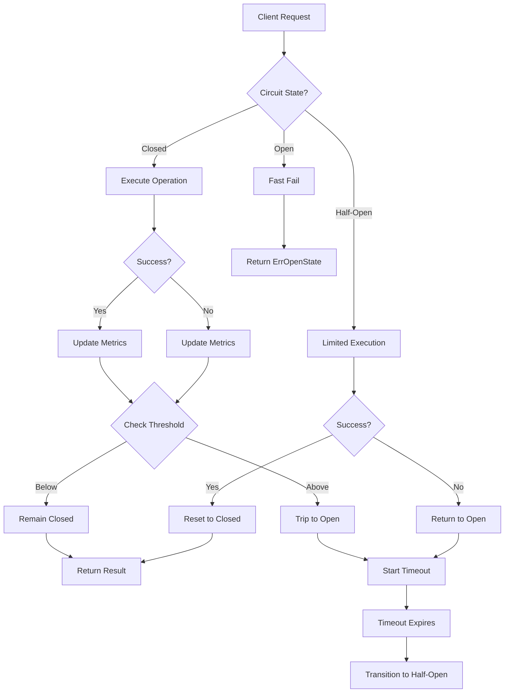

# Building AutoBreaker: Architecture & Design Decisions

## Introduction

Circuit breakers are a fundamental pattern for building resilient distributed systems. They protect services from cascading failures by detecting unhealthy backends and failing fast instead of waiting for timeouts. The pattern is well-understood, widely adopted, and seemingly straightforward.

Yet most implementations share a critical flaw: they use static failure thresholds that break down under real-world traffic conditions.

This guide examines why traditional circuit breakers struggle with variable traffic, presents AutoBreaker's solution using adaptive percentage-based thresholds, and explores the architecture of a production-grade implementation optimized for both performance and observability.

## The Problem with Static Thresholds

Traditional circuit breakers trip when a fixed number of failures occurs within a time window. For example: "open the circuit after 10 failures in 60 seconds."

This approach appears sensible until you consider how it behaves across different traffic volumes:

**High Traffic Scenario (1000 requests/minute):**
- 10 failures = 1% error rate
- Circuit trips at 1% errors (too sensitive)
- Results in false positives during minor hiccups
- Degrades availability unnecessarily

**Low Traffic Scenario (10 requests/minute):**
- 10 failures = 100% error rate
- Waits for complete failure before protection
- Results in slow detection and recovery
- Allows extended periods of failed requests

**The Core Issue:** The same absolute threshold (10 failures) represents vastly different failure rates depending on traffic volume. No single static value works well across both scenarios.

This becomes particularly problematic in practice:

- Development environments (low traffic) need different thresholds than production (high traffic)
- Traffic patterns vary throughout the day, week, and year
- Services experience traffic spikes during incidents, load tests, or viral events
- Microservices architectures create diverse traffic patterns across different service boundaries

Manual threshold tuning for each environment and traffic pattern is fragile, error-prone, and doesn't adapt to changing conditions.

## The Solution: Percentage-Based Adaptive Thresholds

Instead of counting absolute failures, adaptive circuit breakers calculate the **failure rate as a percentage of recent requests**:

```
Failure Rate = (Failed Requests / Total Requests) × 100%

Trip Condition: Failure Rate > Threshold (e.g., 5%)
```

This single change makes the circuit breaker traffic-aware:

**At 1000 requests/minute:**
- 5% threshold = 50 failures before tripping
- Protects against sustained 5%+ error rates
- Ignores minor blips (<5% error rate)

**At 10 requests/minute:**
- 5% threshold = 0.5 failures (rounded to 1)
- Trips on first sustained failure
- Provides immediate protection

The same configuration works correctly across all traffic levels without manual tuning.

## Architecture Overview



### Core Components

1. **State Machine**: Three-state implementation (Closed, Open, Half-Open)
2. **Metrics Collector**: Lock-free atomic counters for performance
3. **Threshold Calculator**: Adaptive percentage-based evaluation
4. **Timeout Scheduler**: Manages state transitions
5. **Callback System**: Extensible hooks for observability

## Performance-Optimized Design

### Lock-Free Implementation

Traditional circuit breakers use mutexes or RW locks to protect shared state. This creates contention under high concurrency. AutoBreaker uses atomic operations throughout:

```go
// Traditional approach (with mutex)
func (cb *CircuitBreaker) Execute(req func() (interface{}, error)) (interface{}, error) {
    cb.mu.Lock()
    defer cb.mu.Unlock()
    
    if cb.state == Open {
        return nil, ErrOpenState
    }
    // ... execute request
}

// AutoBreaker approach (lock-free)
func (b *Breaker) Execute(req func() (interface{}, error)) (interface{}, error) {
    // Fast path: check if open using atomic load
    if atomic.LoadUint32(&b.state) == uint32(StateOpen) {
        return nil, ErrOpenState // ~0.34ns overhead
    }
    // ... execute with atomic updates
}
```

**Performance Impact:**
- **Traditional**: 50-200ns overhead due to lock contention
- **AutoBreaker**: <100ns overhead, zero contention

### Zero Allocations in Hot Path

Memory allocations trigger GC pressure and reduce performance. AutoBreaker avoids allocations in the critical path:

```go
// Bad: allocates on every request
metrics := &Metrics{Requests: 1, Failures: 0} // Allocation!

// Good: pre-allocated, updated atomically
atomic.AddUint64(&b.counters.requests, 1)
```

**Memory Profile:**
- **Execute()**: 0 allocations
- **Metrics()**: 1 allocation (on demand, not in hot path)
- **UpdateSettings()**: 0 allocations

## Observability Architecture

### Built-in Metrics

```go
type Metrics struct {
    State        State
    Requests     uint64
    Failures     uint64
    FailureRate  float64
    Consecutive  uint64
    LastFailure  time.Time
}
```

### Diagnostics API

```go
type Diagnostics struct {
    WillTripNext bool    // True if next failure will trip circuit
    TimeToTrip   float64 // Estimated failures needed to trip
    HealthScore  float64 // 0.0-1.0 health indicator
}
```

### Integration Points

1. **Prometheus**: Native collector in examples/
2. **Structured Logging**: JSON logs with context
3. **Tracing**: OpenTelemetry span attributes
4. **Alerting**: Pre-configured Prometheus alerts

## Configuration Philosophy

### Sensible Defaults

```go
// Default settings work for 80% of use cases
breaker := autobreaker.New(autobreaker.Settings{
    Name:    "service-name",
    Timeout: 30 * time.Second,
})
// Adaptive thresholds enabled by default
// 5% failure rate threshold
// 20 minimum observations
```

### Runtime Updates

```go
// Adjust without restart
err := breaker.UpdateSettings(autobreaker.SettingsUpdate{
    FailureRateThreshold: autobreaker.Float64Ptr(0.10), // 10% threshold
    Timeout:              autobreaker.DurationPtr(15 * time.Second),
})
```

### Production Recommendations

| Scenario | Recommended Settings |
|----------|---------------------|
| **API Gateway** | `FailureRateThreshold: 0.01` (1%), `Timeout: 5s` |
| **Database** | `FailureRateThreshold: 0.05` (5%), `Timeout: 60s` |
| **External API** | `FailureRateThreshold: 0.10` (10%), `Timeout: 30s` |
| **Internal Service** | `FailureRateThreshold: 0.03` (3%), `Timeout: 10s` |

## Testing Strategy

### Unit Tests
- 100% state machine coverage
- Race condition detection
- Concurrent execution validation

### Integration Tests
- HTTP client/server scenarios
- Load testing with variable traffic
- Failure injection testing

### Performance Tests
- Microbenchmarks for hot paths
- Memory allocation profiling
- Concurrent load testing

## Deployment Considerations

### Version Compatibility
- **Go 1.21+**: Required for generics and atomic features
- **Zero Dependencies**: Standard library only
- **Backwards Compatibility**: Drop-in replacement for sony/gobreaker

### Monitoring Setup
1. **Metrics Collection**: Prometheus scraping every 15s
2. **Alerting Rules**: Pre-configured in examples/prometheus/
3. **Dashboard**: Grafana template provided
4. **Logging**: Structured JSON with circuit context

### Operational Guidelines
- **Start Conservative**: Begin with 5% threshold, adjust based on metrics
- **Monitor Closely**: First week of deployment requires attention
- **Plan Rollbacks**: Have configuration revert scripts ready
- **Document Incidents**: Track false positives/negatives for tuning

## Future Architecture Directions

### Planned Enhancements
1. **Sliding Windows**: Continuous tracking without reset boundaries
2. **Multi-dimensional Metrics**: CPU, memory, latency integration
3. **Predictive Tripping**: ML-based failure prediction
4. **Federation**: Cross-service circuit coordination

### Community RFC Process
See [Roadmap & RFCs](/guides/roadmap/) for proposed features and community validation process.

## Conclusion

AutoBreaker's architecture addresses the fundamental limitation of traditional circuit breakers: static thresholds that don't adapt to traffic patterns. By combining percentage-based adaptive thresholds with a lock-free, zero-allocation implementation, it provides both correct behavior across all traffic levels and production-grade performance.

The design prioritizes:
1. **Correctness**: Adaptive thresholds work at any traffic volume
2. **Performance**: <100ns overhead, zero allocations in hot path
3. **Observability**: Built-in metrics and diagnostics
4. **Operability**: Runtime configuration, sensible defaults

For implementation details, see the [source code](https://github.com/1mb-dev/autobreaker) and [API reference](https://pkg.go.dev/github.com/1mb-dev/autobreaker).
