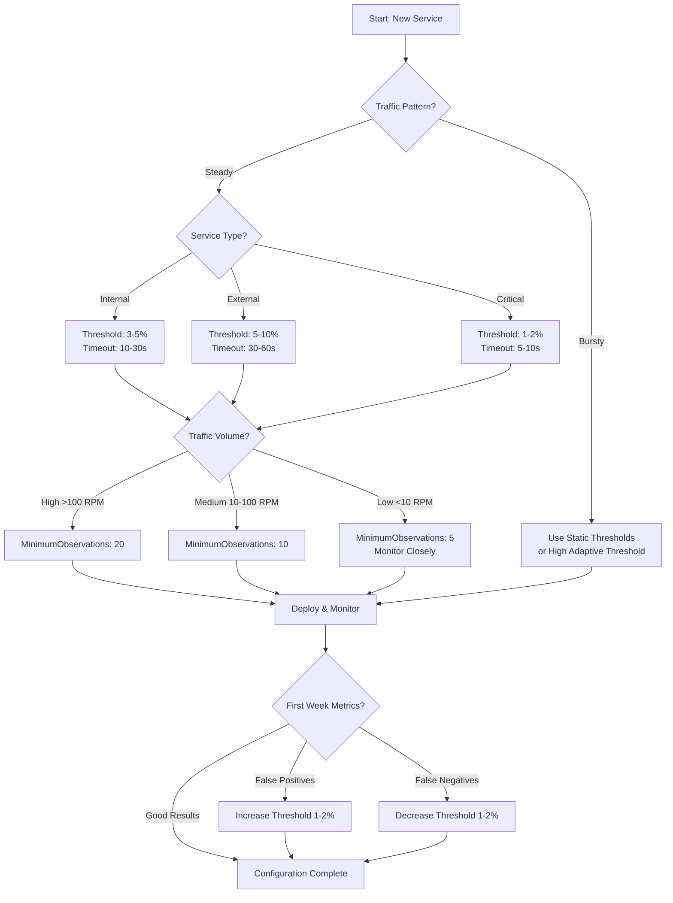

# Decision Guide: When and How to Use AutoBreaker

## Introduction

Choosing the right circuit breaker configuration depends on your specific use case, traffic patterns, and reliability requirements. This guide helps you make informed decisions about when to use AutoBreaker and how to configure it for optimal results.

## When to Use AutoBreaker

### ✅ Good Use Cases

**1. Microservices Communication**
- **Scenario**: Service-to-service calls in distributed systems
- **Why AutoBreaker**: Adaptive thresholds handle varying traffic between services
- **Recommended Config**: `FailureRateThreshold: 0.05` (5%), `Timeout: 30s`

**2. External API Integration**
- **Scenario**: Calling third-party APIs (payment processors, weather APIs, etc.)
- **Why AutoBreaker**: External services have unpredictable failure patterns
- **Recommended Config**: `FailureRateThreshold: 0.10` (10%), `Timeout: 60s`

**3. Database Operations**
- **Scenario**: Database queries with connection pools
- **Why AutoBreaker**: Protects against database degradation or network issues
- **Recommended Config**: `FailureRateThreshold: 0.03` (3%), `Timeout: 10s`

**4. File System/Network Operations**
- **Scenario**: Reading/writing to network storage, S3, etc.
- **Why AutoBreaker**: Network timeouts and transient failures are common
- **Recommended Config**: `FailureRateThreshold: 0.05` (5%), `Timeout: 15s`

### ⚠️ Use with Caution

**1. Critical Path Operations**
- **Scenario**: Authentication, authorization, core business logic
- **Consideration**: Circuit breakers add latency; ensure fallback strategies exist
- **Recommendation**: Use conservative thresholds (1-2%) with comprehensive monitoring

**2. Very Low Traffic Services**
- **Scenario**: <10 requests per minute
- **Consideration**: Adaptive thresholds need minimum observations
- **Recommendation**: Set `MinimumObservations: 5` and monitor closely

**3. Batch Processing**
- **Scenario**: Background jobs, data processing pipelines
- **Consideration**: Traffic patterns are bursty, not steady
- **Recommendation**: Consider disabling adaptive thresholds or using very high thresholds

### ❌ Not Recommended

**1. Synchronous User-Facing Requests**
- **Scenario**: Direct user interactions where immediate feedback is critical
- **Reason**: Circuit open state returns error immediately; users need graceful degradation
- **Alternative**: Use retries with exponential backoff instead

**2. Memory/CPU Bound Operations**
- **Scenario**: In-process computations, algorithm execution
- **Reason**: Circuit breakers protect against external failures, not resource exhaustion
- **Alternative**: Use rate limiting or resource monitoring

**3. Stateless Operations**
- **Scenario**: Pure functions, mathematical calculations
- **Reason**: No external dependencies to protect
- **Alternative**: Input validation and error handling instead

## Configuration Decision Tree



## Threshold Selection Guide

### Failure Rate Thresholds

| Threshold | Use Case | Pros | Cons |
|-----------|----------|------|------|
| **1-2%** | Critical services (auth, payments) | Very sensitive, fast protection | Many false positives, reduces availability |
| **3-5%** | Internal microservices | Good balance, handles minor blips | May allow some degradation |
| **5-10%** | External APIs, non-critical | Few false positives, high availability | Slower to react to real failures |
| **10%+** | Background jobs, batch processing | Maximum availability | Very slow failure detection |

### Timeout Duration

| Duration | Use Case | Recovery Behavior |
|----------|----------|-------------------|
| **5-10s** | Fast-recovering services | Quick retry, minimal downtime |
| **30s** | Typical microservices | Balanced recovery time |
| **60s** | External APIs, databases | Conservative, allows backend recovery |
| **2-5m** | Very slow services | Prevents rapid cycling |

### Minimum Observations

| Value | Traffic Level | Behavior |
|-------|--------------|----------|
| **5** | Very low (<10 RPM) | Quick evaluation, may be noisy |
| **10** | Low-medium (10-50 RPM) | Balanced stability/sensitivity |
| **20** | Medium-high (50-500 RPM) | Stable, filters noise |
| **50** | High (>500 RPM) | Very stable, slow to react |

## Migration Decisions

### From sony/gobreaker

**When to Migrate:**
- You experience false positives/negatives due to traffic variations
- You maintain different configurations for dev/production
- You want runtime configuration updates

**Migration Strategy:**
1. Start with same absolute threshold converted to percentage
   ```go
   // sony/gobreaker: MaxRequests: 10
   // AutoBreaker equivalent: ~5% at 200 RPM
   FailureRateThreshold: 0.05
   MinimumObservations: 20
   ```
2. Deploy side-by-side with monitoring
3. Gradually adjust based on metrics

### From No Circuit Breaker

**When to Add AutoBreaker:**
- You experience cascading failures
- External dependencies cause service outages
- You want to improve system resilience

**Implementation Strategy:**
1. Start with conservative defaults (5%, 30s timeout)
2. Add comprehensive monitoring
3. Implement fallback strategies
4. Test failure scenarios

## Monitoring & Alerting Decisions

### What to Monitor

**Essential Metrics:**
1. **Circuit State**: Percentage of time in each state
2. **Failure Rate**: Actual vs threshold
3. **Request Volume**: RPM to understand traffic patterns
4. **Trip Events**: Count of state transitions

**Advanced Metrics:**
1. **False Positive Rate**: Trips without backend issues
2. **Detection Time**: Time from failure to circuit open
3. **Recovery Time**: Time from fix to circuit closed

### Alerting Strategy

**Immediate Alerts (Pager Duty):**
- Circuit stuck in Open state > 5 minutes
- Multiple circuits tripping simultaneously
- Failure rate > 20% (severe degradation)

**Warning Alerts (Slack/Email):**
- Circuit tripped (any state change)
- Failure rate approaching threshold (80% of threshold)
- Traffic pattern changes (>50% increase/decrease)

**Informational (Dashboards):**
- Daily circuit health report
- Configuration effectiveness analysis
- Trend analysis for threshold tuning

## Performance vs Protection Trade-offs

### Performance-First Configuration

```go
breaker := autobreaker.New(autobreaker.Settings{
    Name:                 "performance-critical",
    Timeout:              5 * time.Second,          // Fast recovery
    FailureRateThreshold: 0.10,                     // High threshold
    MinimumObservations:  50,                       // Stable evaluation
    // No callbacks to avoid overhead
})
```
**Impact**: <50ns overhead, slower failure detection

### Protection-First Configuration

```go
breaker := autobreaker.New(autobreaker.Settings{
    Name:                 "protection-critical",
    Timeout:              60 * time.Second,         // Conservative recovery
    FailureRateThreshold: 0.02,                     // Low threshold
    MinimumObservations:  10,                       // Sensitive evaluation
    OnStateChange: func(name string, from, to State) {
        go alerting.Send(name, from, to)            // Async alerts
    },
})
```
**Impact**: ~100ns overhead, fast failure detection

## Common Decision Pitfalls

### 1. Over-Protection
**Symptoms**: Frequent false positives, reduced availability
**Solution**: Increase threshold by 1-2%, increase MinimumObservations

### 2. Under-Protection
**Symptoms**: Cascading failures, slow detection
**Solution**: Decrease threshold by 1-2%, add more aggressive monitoring

### 3. Configuration Drift
**Symptoms**: Different environments behave differently
**Solution**: Use runtime configuration, centralize config management

### 4. Monitoring Blind Spots
**Symptoms**: Incidents without alerts, missed trends
**Solution**: Implement comprehensive metrics, regular dashboard reviews

## Decision Checklist

Before deploying AutoBreaker:

- [ ] **Use Case Validated**: Matches one of the "Good Use Cases"
- [ ] **Traffic Analysis**: Understand RPM patterns and variations
- [ ] **Threshold Selected**: Based on service criticality and traffic
- [ ] **Timeout Configured**: Matches expected recovery time
- [ ] **Monitoring Setup**: Essential metrics tracked and alerted
- [ ] **Fallback Strategy**: Graceful degradation plan exists
- [ ] **Testing Plan**: Failure scenarios tested in staging
- [ ] **Rollback Plan**: Configuration revert process documented
- [ ] **Team Trained**: Ops team understands circuit behavior
- [ ] **Documentation Updated**: Runbooks include circuit breaker procedures

## Getting Help

If you're unsure about configuration decisions:

1. **Start with Examples**: Run `examples/production_ready/` to see various scenarios
2. **Use Community**: Check [GitHub Issues](https://github.com/vnykmshr/autobreaker/issues) for similar use cases
3. **Monitor Closely**: Deploy with aggressive monitoring for first week
4. **Iterate**: Adjust based on real metrics, not assumptions

Remember: The best configuration is one that evolves with your service's actual behavior. Start conservative, monitor aggressively, and adjust based on data.
