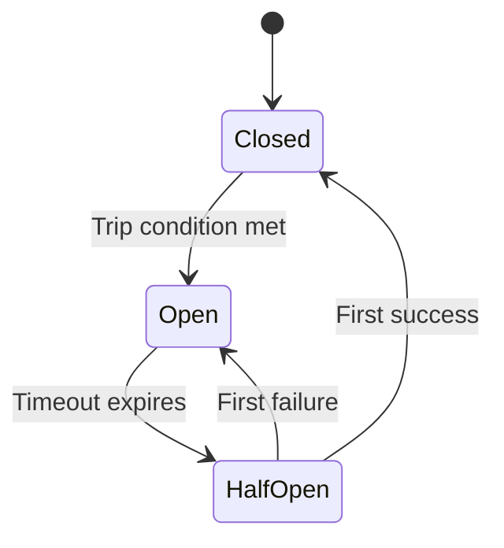

# State Machine

AutoBreaker implements a three-state circuit breaker pattern with adaptive thresholds.

## States



### State Definitions

**CLOSED (0)**
- Normal operation mode
- All requests flow through
- Counts track success/failure statistics
- Transitions to OPEN when `ReadyToTrip` condition is met

**OPEN (1)**
- Protection mode - service assumed unhealthy
- All requests immediately rejected with `ErrOpenState`
- After `Timeout` duration, transitions to HALF-OPEN

**HALF-OPEN (2)**
- Recovery testing mode
- Limited requests allowed (up to `MaxRequests` concurrent)
- First failure → immediate transition to OPEN
- First success → immediate transition to CLOSED
- Excess concurrent requests rejected with `ErrTooManyRequests`

## State Transitions

### CLOSED → OPEN

**Trigger:** `ReadyToTrip(counts) == true`

**When Evaluated:** After each request completes

**Default Condition:** `ConsecutiveFailures > 5`

**Adaptive Enhancement:**
```go
// Traditional (absolute)
ConsecutiveFailures > threshold

// Adaptive (percentage-based)
(TotalFailures / Requests) > failureRateThreshold
```

### OPEN → HALF-OPEN

**Trigger:** `time.Since(openStateTimestamp) >= Timeout`

**When Evaluated:** On next request arrival after timeout expires

**Default Timeout:** 60 seconds

### HALF-OPEN → CLOSED

**Trigger:** First successful request completion in HALF-OPEN state

### HALF-OPEN → OPEN

**Trigger:** First failed request in HALF-OPEN state

## Counts Management

### Counts Structure
```go
type Counts struct {
    Requests             uint32  // Total requests in current state
    TotalSuccesses       uint32  // Total successful requests
    TotalFailures        uint32  // Total failed requests
    ConsecutiveSuccesses uint32  // Streak of successes
    ConsecutiveFailures  uint32  // Streak of failures
}
```

### Count Update Rules

**On Request Start:**
- `Requests++` (in CLOSED and HALF-OPEN states)

**On Successful Completion:**
- `TotalSuccesses++`
- `ConsecutiveSuccesses++`
- `ConsecutiveFailures = 0`

**On Failed Completion:**
- `TotalFailures++`
- `ConsecutiveFailures++`
- `ConsecutiveSuccesses = 0`

**On State Transition:**
- All counts reset to 0

## Concurrency Guarantees

### MaxRequests Enforcement (HALF-OPEN)

**Rule:** Maximum `MaxRequests` concurrent requests in HALF-OPEN state

**Implementation:**
```go
// Atomic counter for concurrent requests
var halfOpenRequests atomic.Int32

// On request entry in HALF-OPEN:
if halfOpenRequests.Add(1) > MaxRequests {
    halfOpenRequests.Add(-1)
    return ErrTooManyRequests
}

// On request completion (success or failure):
halfOpenRequests.Add(-1)
```

## Edge Cases

### Time Jumps
Uses monotonic time (`time.Since()`) to prevent issues from NTP adjustments.

### Concurrent State Transitions
Atomic compare-and-swap (CAS) ensures only one goroutine wins state transition races.

### Context Cancellation
Treated as failure by default (request didn't succeed). Override via `IsSuccessful` if needed.

### Rapid State Oscillation
Allowed - fail-fast recovery. Future versions may add exponential backoff.

## Performance

- **State Check Latency:** <50ns (lock-free atomic read)
- **Transition Latency:** <1μs (atomic CAS + callback)
- **Count Update Latency:** <20ns (atomic increment)
- **Memory Overhead:** <200 bytes per breaker instance
- **Concurrency:** Handles 1M+ RPS on modern hardware
